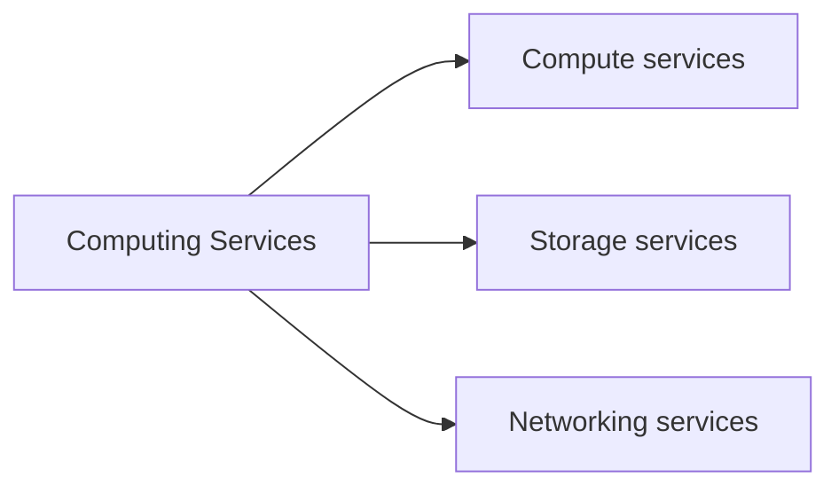

# DESCRIBE CLOUD CONCEPTS

## I. CLOUD COMPUTING

Cloud computing is the delivery of **computing services** over the internet.

## II. SHARED RESPONSIBILITY MODEL

- When using a cloud provider, you’ll always be responsible for:

1. The information and data stored in the cloud
2. Devices that are allowed to connect to your cloud (cell phones, computers, and so on)
3. The accounts and identities of the people, services, and devices within your organization

- The cloud provider is always responsible for:

1. The physical datacenter
2. The physical network
3. The physical hosts

- Your service model will determine responsibility for things like:

1. Operating systems
2. Network controls
3. Applications
4. Identity and infrastructure
