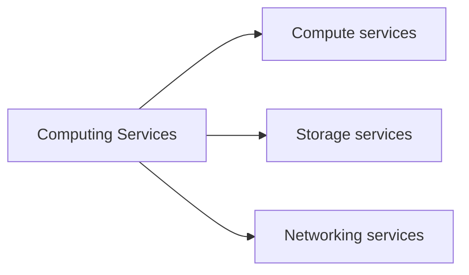
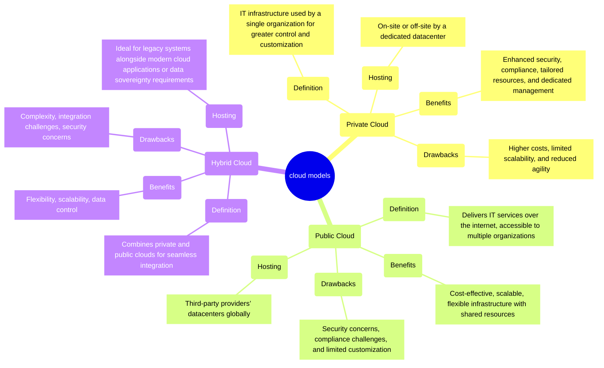
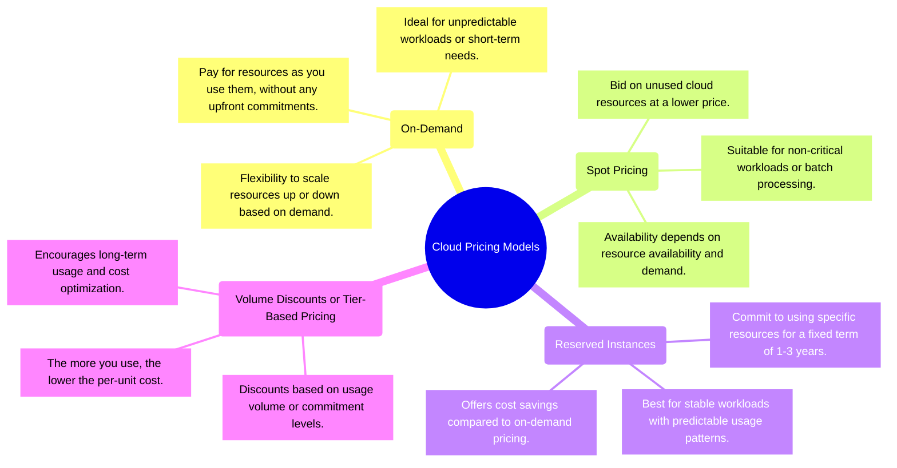

# MODULE 1: DESCRIBE CLOUD CONCEPTS

# SECTION 1: DESCRIBE CLOUD COMPUTING

## I. CLOUD COMPUTING

Cloud computing is the **delivery of computing services** over the internet.

## II. SHARED RESPONSIBILITY MODEL

**1. When using a cloud provider, you’ll always be responsible for:**

- The information and data stored in the cloud
- Devices that are allowed to connect to your cloud (cell phones, computers, and so on)
- The accounts and identities of the people, services, and devices within your organization

**2. The cloud provider is always responsible for:**

- The physical datacenter
- The physical network
- The physical hosts

**3. Your service model will determine responsibility for things like:**

- Operating systems
- Network controls
- Applications
- Identity and infrastructure

## III. CLOUD MODELS

### BASED ON HOSTING:

### BASED ON PRICING:

# SECTION 2: AZURE SERVICES AND ACCOUNTS

## I. ARCHITECTURE OF A AZURE ACCOUNT

[image1](./image.png)

